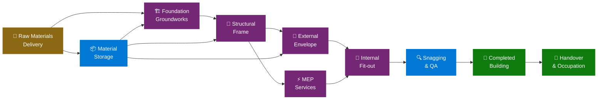

<p align="center">
  
  
  
  
</p>

<h1 align="center">🏗️ Construction Building Site — Microsoft Fabric IQ Ontology Accelerator</h1>

<p align="center">
  <strong>Deploy a production-ready IQ Ontology for a Construction Building Site on Microsoft Fabric — fully automated, one command.</strong>
</p>

<p align="center">
  
  
  
  
  
  
</p>

<p align="center">
  <a href="#-quick-start">Quick Start</a> •
  <a href="#ontology-entity-model">Entity Model</a> •
  <a href="#what-gets-deployed">What Gets Deployed</a> •
  <a href="#-kql-real-time-dashboard">Dashboard</a> •
  <a href="#-graph-query-set-gql">Graph Queries</a> •
  <a href="#-operations-agent-real-time-intelligence">Operations Agent</a>
</p>

---

## 🌐 Overview

This accelerator provides a ready-to-use **Microsoft Fabric IQ Ontology (preview)** for a **Construction Building Site** project. It includes sample data, ontology design documentation, and step-by-step setup instructions to model:

<table>
<tr>
<td width="50%">

### 🏗️ Physical Assets
- 🏢 **Building Sites** — project locations, contract value & status
- 🔧 **Work Zones** — Foundation, Framing, MEP, Electrical, Finishing
- 🏗️ **Construction Assets** — cranes, excavators, scaffolding, mixers
- 📦 **Material Storage** — on-site depots, stockpile areas & levels
- 🧱 **Raw Materials** — concrete, steel, timber, glass, aggregate

</td>
<td width="50%">

### 📊 Operations & Monitoring
- 🏁 **Completed Work** — slab poured, wall erected, roof installed
- 📡 **IoT Sensors** — dust, noise, vibration, temperature, load sensors
- 🔍 **Inspection Events** — safety audits, quality checks, equipment inspections
- 🚨 **Safety Incidents** — near-miss, PPE violation, fall risk, fire hazard
- 👷 **Workers** — tradespeople, contractors, site managers, H&S officers
- 🔗 **Supply Chain** — material flow between work zones & suppliers

</td>
</tr>
</table>

---

## 🧬 Ontology Entity Model

<details>
<summary><b>📋 Entity Types</b> (click to expand)</summary>
<br/>

| | Entity Type | Key Property | Description |
|---|---|---|---|
| 🏢 | **BuildingSite** | `SiteId` | Construction project location with contract value and status |
| 🔧 | **WorkZone** | `ZoneId` | Logical zone on site: Foundation, Framing, MEP, Electrical, Finishing |
| 🏗️ | **ConstructionAsset** | `AssetId` | Physical asset: crane, excavator, scaffolding, concrete mixer |
| 👷 | **Worker** | `WorkerId` | Tradesperson, contractor, site manager, H&S officer |
| 🧱 | **RawMaterial** | `MaterialId` | Input material: concrete, steel, timber, glass, aggregate |
| 📦 | **MaterialStorage** | `StorageId` | On-site depot, skip bin, stockpile area with capacity tracking |
| 📡 | **IoTSensor** | `SensorId` | Dust, noise, vibration, temperature, load sensors on site |
| 🚨 | **SafetyIncident** | `IncidentId` | Near-miss, PPE violation, fall risk, fire hazard event |
| 🔍 | **InspectionEvent** | `InspectionId` | Safety audit, quality check, equipment inspection |
| 📈 | **WorkProgress** | `ProgressId` | Daily work progress tracking per zone |
| 🔗 | **SupplyChain** | `MaterialId–ZoneId` | Material flow between work zones and external suppliers |

</details>

<details>
<summary><b>🔀 Relationship Types</b> (click to expand)</summary>
<br/>

| | Relationship | From → To | Cardinality | Description |
|---|---|---|---|---|
| 🏢→🔧 | **SiteContainsZone** | BuildingSite → WorkZone | `1:N` | A building site contains multiple work zones |
| 🔧→🏗️ | **ZoneDeploysAsset** | WorkZone → ConstructionAsset | `1:N` | A work zone deploys construction assets |
| 🏗️→📡 | **AssetHasSensor** | ConstructionAsset → IoTSensor | `1:N` | An asset has IoT sensors mounted on it |
| 📡→🔧 | **SensorInZone** | IoTSensor → WorkZone | `N:1` | A sensor is deployed in a work zone |
| 🧱→🔧 | **MaterialFeedsZone** | RawMaterial → WorkZone | `N:N` | Raw materials feed into work zones (via bridge) |
| 📦→🧱 | **StorageHoldsMaterial** | MaterialStorage → RawMaterial | `N:1` | Storage holds a specific raw material |
| 📦→🏢 | **StorageAtSite** | MaterialStorage → BuildingSite | `N:1` | Storage is located at a building site |
| 🚨→🔧 | **IncidentInZone** | SafetyIncident → WorkZone | `N:1` | Incident occurred in a work zone |
| 🚨→👷 | **IncidentInvolvesWorker** | SafetyIncident → Worker | `N:1` | Incident involves a worker |
| 🔍→🏗️ | **InspectionTargetsAsset** | InspectionEvent → ConstructionAsset | `N:1` | Inspection targets an asset |
| 🔍→👷 | **InspectionByWorker** | InspectionEvent → Worker | `N:1` | Inspection performed by an inspector |
| 👷→🏢 | **WorkerAssignedToSite** | Worker → BuildingSite | `N:1` | Worker assigned to a building site |

</details>

---

## 📂 Files Structure

<details>
<summary><b>🗂️ Full project tree</b> (click to expand)</summary>

```
Ontology-RTI-Construction/
├── 📄 README.md                              # This file
├── 📄 SETUP_GUIDE.md                         # Step-by-step Fabric setup instructions
├── 📄 SEMANTIC_MODEL_GUIDE.md                # Power BI semantic model configuration
├── 🚀 Deploy-ConstructionOntology.ps1        # Main automated deployment script (Steps 0-10)
├── 📊 data/
│   ├── DimBuildingSite.csv                   # 🏢 Building site dimension data
│   ├── DimWorkZone.csv                       # 🔧 Work zone dimension data
│   ├── DimConstructionAsset.csv              # 🏗️ Construction asset dimension data
│   ├── DimWorker.csv                         # 👷 Worker dimension data
│   ├── DimRawMaterial.csv                    # 🧱 Raw material dimension data
│   ├── DimMaterialStorage.csv                # 📦 Material storage dimension data
│   ├── DimIoTSensor.csv                      # 📡 IoT sensor dimension data
│   ├── FactSafetyIncident.csv                # 🚨 Safety incident fact data
│   ├── FactInspectionEvent.csv               # 🔍 Inspection event fact data
│   ├── FactWorkProgress.csv                  # 📈 Daily work progress fact data
│   ├── BridgeMaterialWorkZone.csv            # 🔗 Raw material to work zone mapping
│   └── SiteTelemetry.csv                     # 📡 Streaming telemetry (for Eventhouse)
├── ⚡ deploy/
│   ├── Build-Ontology.ps1                    # 🧬 Ontology definition builder (59 parts)
│   ├── Build-GraphModel-v2.ps1               # 🕸️ Graph model builder
│   ├── Deploy-RTIDashboard.ps1               # 📊 KQL Real-Time Dashboard (12 tiles)
│   ├── Deploy-DataAgent.ps1                  # 🤖 Fabric Data Agent (requires F64+)
│   ├── Deploy-OperationsAgent.ps1            # 🧠 Operations Agent (RTI, Teams)
│   ├── Deploy-GraphQuerySet.ps1              # 🔍 Graph Query Set item creator
│   ├── Deploy-KqlTables.ps1                  # 🗄️ KQL table creation and data ingestion
│   ├── LoadDataToTables.py                   # 🐍 PySpark notebook for CSV → Delta tables
│   ├── ConstructionGraphQueries.gql          # 📝 GQL query reference file
│   ├── Validate-Deployment.ps1               # ✅ Post-deployment validation
│   ├── SemanticModel.bim                     # 📦 Legacy BIM definition
│   └── SemanticModel/                        # 📐 TMDL semantic model definition
│       ├── definition.pbism                  # Semantic model binding
│       └── definition/                       # Table & relationship TMDL files
└── 🖼️ diagrams/
    └── ontology_diagram.md                   # Visual representation of the ontology
```

</details>

---

## ⚡ Quick Start

### 🅰️ Automated Deployment (Recommended)

```powershell
# That's it. One command.
cd Ontology-RTI-Construction
.\Deploy-ConstructionOntology.ps1 -WorkspaceId "your-workspace-guid"
```

> [!TIP]
> **Prerequisites:** PowerShell 5.1+, Az module, Fabric workspace. The script automates all 10 steps — see [SETUP_GUIDE.md](SETUP_GUIDE.md#automated-deployment).

### 🅱️ Manual Setup

<details>
<summary><b>📝 Step-by-step manual deployment</b> (click to expand)</summary>
<br/>

| Step | Action | Guide |
|:---:|--------|-------|
| 1️⃣ | **Enable prerequisites** — Tenant settings & capacity | [SETUP_GUIDE.md](SETUP_GUIDE.md) |
| 2️⃣ | **Upload data** — Load CSV files into a Fabric Lakehouse | `data/` folder |
| 3️⃣ | **Create semantic model** — Direct Lake model | [SEMANTIC_MODEL_GUIDE.md](SEMANTIC_MODEL_GUIDE.md) |
| 4️⃣ | **Generate ontology** — Build from semantic model | Fabric IQ UI |
| 5️⃣ | **Set up Eventhouse** — Upload `SiteTelemetry.csv` | Fabric Eventhouse |
| 6️⃣ | **RTI Dashboard** — Open & configure dashboard | Fabric Dashboard |
| 7️⃣ | **Graph Query Set** — Run GQL queries | Fabric GQS UI |

</details>

### 🎯 What Gets Deployed

| | Item | Type | Description |
|---|------|------|-------------|
| 🗄️ | `ConstructionSiteLH` | **Lakehouse** | 12 Delta tables with construction site data |
| 📓 | `ConstructionSite_LoadTables` | **Notebook** | PySpark notebook for CSV → Delta table loading |
| 📡 | `ConstructionTelemetryEH` | **Eventhouse** | Real-time telemetry with 5 KQL tables (auto-populated) |
| 📊 | `ConstructionSiteModel` | **Semantic Model** | Direct Lake model (12 tables, 16 relationships) |
| 🧬 | `ConstructionSiteOntology` | **Ontology** | 59-part ontology definition |
| 🕸️ | `ConstructionSiteOntology_graph_*` | **GraphModel** | Graph model with full query readiness |
| 📈 | `ConstructionSiteDashboard` | **KQL Dashboard** | 12 real-time visualization tiles |
| 🔍 | `ConstructionSiteQueries` | **Graph Query Set** | Empty shell (add GQL queries manually via UI) |
| 🤖 | `ConstructionSiteAgent` | **Data Agent** | Ontology-powered NL query agent (requires F64+) |
| 🧠 | `ConstructionOperationsAgent` | **Operations Agent** | AI agent monitoring KQL telemetry → Teams |

---

## 🏗️ Domain Context

### 🔄 Construction Site Workflow



### 📏 Key Metrics Tracked

<table>
<tr>
<td width="50%">

| | Metric | Details |
|---|--------|--------|
| 📈 | **Work Progress** | % completion per zone per day |
| 🏗️ | **Asset Utilisation** | Active vs. idle construction assets |
| 📡 | **Sensor Readings** | Dust, noise, vibration, temperature, load |
| 🧱 | **Material Deliveries** | Tonnage received & consumed per zone |

</td>
<td width="50%">

| | Metric | Details |
|---|--------|--------|
| 🔍 | **Inspections** | Pass/fail rate, overdue inspections |
| 🚨 | **Safety Incidents** | Frequency, severity (CDM compliance) |
| 📦 | **Storage Utilisation** | Current level vs. capacity |
| 👷 | **Worker Activity** | Trade allocation & site presence |

</td>
</tr>
</table>

---

## 📊 KQL Real-Time Dashboard

<p align="center">
  
  
  
</p>

The `ConstructionSiteDashboard` provides **12 visualization tiles** across **5 KQL tables**:

<details>
<summary><b>🖥️ All dashboard tiles</b> (click to expand)</summary>
<br/>

| | Tile | Visual | Data Source |
|---|------|--------|-------------|
| 📈 | Sensor Readings by Zone | Line chart | `SiteSensorReading` |
| 🥧 | Safety Incidents by Severity | Pie chart | `SafetyIncidentLog` |
| 📈 | Incident Trend Over Time | Line chart | `SafetyIncidentLog` |
| 🗺️ | Live Site Asset Map | Map | Inline coordinates |
| 📋 | Top Sensors by Alert Count | Table | `SiteSensorReading` |
| 🔎 | Dust & Noise Compliance | Table | `SiteSensorReading` |
| 📈 | Material Deliveries Today | Line chart | `MaterialDeliveryEvent` |
| 📋 | Work Progress per Zone | Table | `WorkProgressMetric` |
| 📋 | Unacknowledged Safety Alerts | Table | `SafetyIncidentLog` |
| ⚠️ | Asset Utilization Rate | Table | `AssetStatusStream` |
| 📋 | Overdue Inspections | Table | `AssetStatusStream` |
| 📈 | Worker Activity on Site | Line chart | `WorkProgressMetric` |

</details>

---

## 🕸️ Graph Query Set (GQL)

<p align="center">
  
  
</p>

The `ConstructionSiteQueries` Graph Query Set is created as an empty shell. Due to a Fabric REST API limitation, queries must be added manually via the UI.

> [!NOTE]
> **To add queries:** Open the GQS in Fabric → select the ontology graph model → copy-paste from [deploy/ConstructionGraphQueries.gql](deploy/ConstructionGraphQueries.gql).

<details>
<summary><b>🔍 All 20 GQL queries</b> (click to expand)</summary>
<br/>

| # | | Query | Pattern |
|---|---|-------|--------|
| 1 | 🌐 | Full Site Topology | `MATCH (n)-[e]->(m) RETURN n, e, m` |
| 2 | 🏢 | Work Zones & Assets | `BuildingSite → WorkZone → ConstructionAsset` |
| 3 | 📡 | Sensors & Safety Incidents | `ConstructionAsset → IoTSensor ← SafetyIncident` |
| 4 | 🔍 | Inspection Events | `Worker ← InspectionEvent → ConstructionAsset` |
| 5 | 🧱 | Material Supply Chain | `RawMaterial ← MaterialFeedsZone → WorkZone` |
| 6 | 📈 | Work Progress Records | `WorkZone ← WorkProgress → Worker` |
| 7 | 📦 | Material Storage | `BuildingSite → MaterialStorage → RawMaterial` |
| 8 | 🔗 | Supply Chain Network | `RawMaterial → WorkZone (via bridge)` |
| 9 | 🔄 | End-to-End | `RawMaterial → ... → CompletedWork` |
| 10 | 👷 | Workforce | `BuildingSite → Worker ← InspectionEvent` |
| 11 | 📡 | Sensors on Specific Asset | Filter by `AssetId` |
| 12 | 🚨 | Open Safety Incidents | `SafetyIncident WHERE Status = 'Open'` |
| 13 | ⚠️ | Assets Without Inspections | Anti-pattern detection |
| 14 | 🚨 | Critical Incidents by Site | Aggregated incident analysis |
| 15 | 🔗 | Material Flow Between Zones | `WorkZone ← Bridge → RawMaterial` |
| 16 | 📦 | Materials Stored per Site | `BuildingSite → MaterialStorage → RawMaterial` |
| 17 | 👷 | Worker Inspection Workload | Workload distribution |
| 18 | 🧱 | Raw Material Cost Analysis | Property-based filtering |
| 19 | 🔄 | Multi-Hop: Material to Completed Zone | Full value chain traversal |
| 20 | 🏗️ | Site Asset Health Summary | Asset status overview |

</details>

---

## 🧠 Operations Agent (Real-Time Intelligence)

<p align="center">
  
  
  
</p>

The `ConstructionOperationsAgent` is a Fabric Operations Agent that continuously monitors KQL Database telemetry and sends actionable recommendations via Microsoft Teams.

<table>
<tr>
<td width="50%">

### 📡 What It Monitors
- 🌡️ Site sensor anomalies (dust, noise, vibration, temperature, load)
- 🚨 Critical/High severity safety incidents & unacknowledged alerts
- 📉 Work progress delays & zone completion slippage
- 💰 Inspection failures, overdue checks, asset downtime

</td>
<td width="50%">

### ✅ Prerequisites
-  capacity (Trial may work for creation)
- 🔑 Tenant admin: enable *Operations Agent* + *Copilot & Azure OpenAI*
-  with *Fabric Operations Agent* app

</td>
</tr>
</table>

### 🚀 Post-Deployment Setup (Fabric UI)

| Step | Action |
|:---:|--------|
| 1️⃣ | Open the agent → Add **Knowledge Source** → Select `ConstructionTelemetryEH` / `ConstructionTelemetryDB` |
| 2️⃣ | Configure **Actions** *(optional)*: Power Automate flows for alerts, work orders, escalations |
| 3️⃣ | **Save** to generate the playbook → **Start** the agent |
| 4️⃣ | Recipients receive proactive recommendations in Teams chat 💬 |
