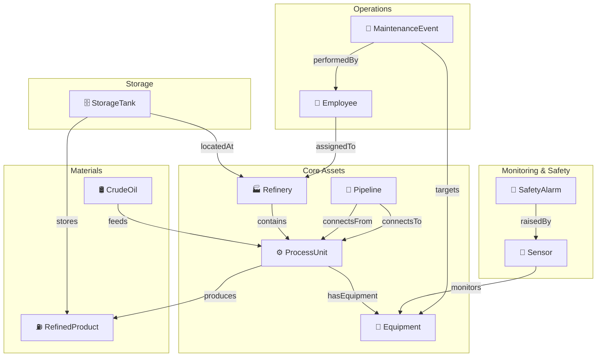

# Ontology Diagram - Oil & Gas Refinery

## Entity-Relationship Model (Mermaid)



## Entity Type Details

### Refinery
```
┌─────────────────────────────────┐
│           REFINERY              │
├─────────────────────────────────┤
│ 🔑 RefineryId          (Key)   │
│    RefineryName         (String)│
│    Country              (String)│
│    State                (String)│
│    City                 (String)│
│    Latitude             (Double)│
│    Longitude            (Double)│
│    CapacityBPD          (Int)   │
│    YearBuilt            (Int)   │
│    Status               (String)│
│    Operator             (String)│
└─────────────────────────────────┘
```

### ProcessUnit
```
┌─────────────────────────────────┐
│         PROCESS UNIT            │
├─────────────────────────────────┤
│ 🔑 ProcessUnitId       (Key)   │
│    ProcessUnitName      (String)│
│    ProcessUnitType      (String)│
│ 🔗 RefineryId          (FK)    │
│    CapacityBPD          (Int)   │
│    DesignTemperatureF   (Double)│
│    DesignPressurePSI    (Double)│
│    YearInstalled        (Int)   │
│    Status               (String)│
│    Description          (String)│
└─────────────────────────────────┘
```

### Equipment
```
┌─────────────────────────────────┐
│          EQUIPMENT              │
├─────────────────────────────────┤
│ 🔑 EquipmentId         (Key)   │
│    EquipmentName        (String)│
│    EquipmentType        (String)│
│ 🔗 ProcessUnitId       (FK)    │
│    Manufacturer         (String)│
│    Model                (String)│
│    InstallDate          (Date)  │
│    LastInspectionDate   (Date)  │
│    Status               (String)│
│    CriticalityLevel     (String)│
│    ExpectedLifeYears    (Int)   │
└─────────────────────────────────┘
```

### Pipeline
```
┌─────────────────────────────────┐
│           PIPELINE              │
├─────────────────────────────────┤
│ 🔑 PipelineId          (Key)   │
│    PipelineName         (String)│
│ 🔗 FromProcessUnitId   (FK)    │
│ 🔗 ToProcessUnitId     (FK)    │
│ 🔗 RefineryId          (FK)    │
│    DiameterInches       (Double)│
│    LengthFeet           (Double)│
│    Material             (String)│
│    MaxFlowBPD           (Int)   │
│    InstalledDate        (Date)  │
│    Status               (String)│
└─────────────────────────────────┘
```

### CrudeOil
```
┌─────────────────────────────────┐
│          CRUDE OIL              │
├─────────────────────────────────┤
│ 🔑 CrudeOilId          (Key)   │
│    CrudeGradeName       (String)│
│    APIGravity           (Double)│
│    SulfurContentPct     (Double)│
│    Origin               (String)│
│    Classification       (String)│
│    PricePerBarrelUSD    (Double)│
│    Description          (String)│
└─────────────────────────────────┘
```

### RefinedProduct
```
┌─────────────────────────────────┐
│       REFINED PRODUCT           │
├─────────────────────────────────┤
│ 🔑 ProductId            (Key)  │
│    ProductName           (String│
│    ProductCategory       (String│
│    APIGravity            (Double│
│    SulfurLimitPPM        (Int)  │
│    FlashPointF           (String│
│    SpecStandard          (String│
│    PricePerBarrelUSD     (Double│
│    Description           (String│
└─────────────────────────────────┘
```

### StorageTank
```
┌─────────────────────────────────┐
│         STORAGE TANK            │
├─────────────────────────────────┤
│ 🔑 TankId              (Key)   │
│    TankName             (String)│
│ 🔗 RefineryId          (FK)    │
│ 🔗 ProductId           (FK)    │
│    TankType             (String)│
│    CapacityBarrels      (Int)   │
│    CurrentLevelBarrels  (Int)   │
│    DiameterFeet         (Double)│
│    HeightFeet           (Double)│
│    Material             (String)│
│    Status               (String)│
│    LastInspectionDate   (Date)  │
└─────────────────────────────────┘
```

### Sensor
```
┌─────────────────────────────────┐
│            SENSOR               │
├─────────────────────────────────┤
│ 🔑 SensorId            (Key)   │
│    SensorName           (String)│
│    SensorType           (String)│
│ 🔗 EquipmentId         (FK)    │
│    MeasurementUnit      (String)│
│    MinRange             (Double)│
│    MaxRange             (Double)│
│    InstallDate          (Date)  │
│    CalibrationDate      (Date)  │
│    Status               (String)│
│    Manufacturer         (String)│
└─────────────────────────────────┘
```

### MaintenanceEvent
```
┌──────────────────────────────────┐
│      MAINTENANCE EVENT           │
├──────────────────────────────────┤
│ 🔑 MaintenanceId        (Key)   │
│ 🔗 EquipmentId          (FK)    │
│    MaintenanceType       (String)│
│    Priority              (String)│
│ 🔗 PerformedByEmployeeId(FK)    │
│    StartDate             (Date)  │
│    EndDate               (Date)  │
│    DurationHours         (Double)│
│    CostUSD              (Double) │
│    Description           (String)│
│    WorkOrderNumber       (String)│
│    Status                (String)│
└──────────────────────────────────┘
```

### SafetyAlarm
```
┌──────────────────────────────────┐
│         SAFETY ALARM             │
├──────────────────────────────────┤
│ 🔑 AlarmId              (Key)   │
│ 🔗 SensorId             (FK)    │
│    AlarmType             (String)│
│    Severity              (String)│
│    AlarmTimestamp         (DateTime)│
│    AcknowledgedTimestamp  (DateTime)│
│    ClearedTimestamp       (DateTime)│
│    AlarmValue            (Double)│
│    ThresholdValue        (Double)│
│    Description           (String)│
│    ActionTaken           (String)│
│ 🔗 AcknowledgedByEmployeeId(FK) │
└──────────────────────────────────┘
```

### Employee
```
┌─────────────────────────────────┐
│           EMPLOYEE              │
├─────────────────────────────────┤
│ 🔑 EmployeeId          (Key)   │
│    FirstName            (String)│
│    LastName             (String)│
│    Role                 (String)│
│    Department           (String)│
│ 🔗 RefineryId          (FK)    │
│    HireDate             (Date)  │
│    CertificationLevel   (String)│
│    ShiftPattern         (String)│
│    Status               (String)│
└─────────────────────────────────┘
```

## Relationship Cardinalities

```
Refinery ──(1)────(N)──> ProcessUnit       "A refinery contains many process units"
ProcessUnit ──(1)────(N)──> Equipment      "A process unit has many equipment items"
CrudeOil ──(N)────(N)──> ProcessUnit       "Crude oils feed into process units (via bridge table)"
ProcessUnit ──(N)────(N)──> RefinedProduct "Process units produce products (via FactProduction)"
Pipeline ──(N)────(1)──> ProcessUnit [From] "Pipeline connects from a source process unit"
Pipeline ──(N)────(1)──> ProcessUnit [To]   "Pipeline connects to a target process unit"
StorageTank ──(N)────(1)──> RefinedProduct  "A tank stores one product type"
StorageTank ──(N)────(1)──> Refinery        "A tank is located at one refinery"
Sensor ──(N)────(1)──> Equipment            "Sensors monitor equipment"
SafetyAlarm ──(N)────(1)──> Sensor          "Alarms are raised by sensors"
MaintenanceEvent ──(N)────(1)──> Equipment  "Maintenance targets equipment"
MaintenanceEvent ──(N)────(1)──> Employee   "Maintenance performed by employee"
Employee ──(N)────(1)──> Refinery           "Employees assigned to a refinery"
```
